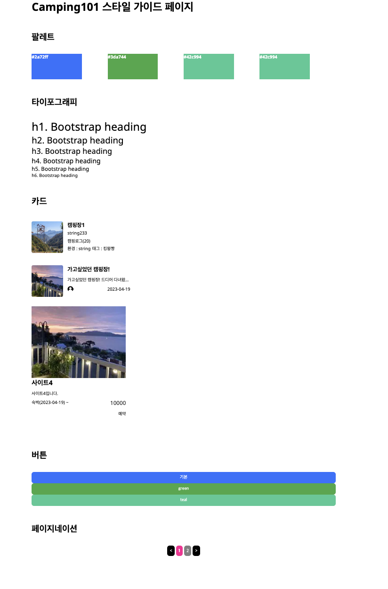

## 소개

[배포링크](https://vercel.live/link/camping101-refector.vercel.app?via=project-overview-visit-button)  
[리팩토링 이전]("https://github.com/gn753/camping101_Front.git)

팀 프로젝트로 백엔드 개발자 두 분과 함꼐 개발한 캠핑예약서비스입니다.
이 저장소는 프로젝트 후 아쉬웠던 부분을 처음부터 다시 재구축했습니다.

테스트용 아이디:test1@naver.com
테스트용 비밀번호:1234

## 주요 기능

- 메인 페이지(헤더) - 캠핑장 리뷰,캠핑장 목록, 로그인 로그아웃 페이지로 진입 가능

- 메인 페이지(컨텐츠) - 실시간 캠핑장/캠핑 리뷰 확인 가능 및 클릭 후 세부 페이지 진입가능

- 캠핑 예약 페이지 - 최대 예약가능일 구현 및 예약 가능한 날짜만을 필터링 해 사용자에게 노출

- 마이페이지 - 개인정보 수정, 관심 캠핑리뷰 리스트, 캠핑장 예약 정보 확인

- 회원인증 - Jwt 리프레시 토큰 활용한 자동 새로고침 처리 및 로그인 , 회원가입 구현

- 스타일 가이드 페이지 - 재 사용되는 컴포넌트를 공통화 코드 중복을 방지하고 유지 보수성을 높여 생산성을 높였고 사용자에게 일관성 있는 UI/UX를 제공합니다

## 핵심 사용 기술 및 개발환경

1. Next js
2. Typescript
3. Recoil
4. Emotion

### 스타일 가이드

### 폴더구조

- components  
  ├── Camp 캠핑장 목록  
  ├── Home 메인페이지  
  ├── Join 회원가입  
  ├── Login 로그인  
  ├── Resv 캠핑장 예약  
  ├── Review 캠핑장 리뷰  
  ├── ReviewDetails 리뷰 상세페이지  
  ├── User 마이페이지  
  └── common 공통  
  ├── AuthCheck 새로고침 시 유저검증  
  │ └── AuthCheck.tsx

- libs : 전역적으로 재사용가능한 상태, api 모음
- pages : 서버사이드전용 api 및 페이지 컴포넌트
- public : 이미지 및 테스트용 데이터
